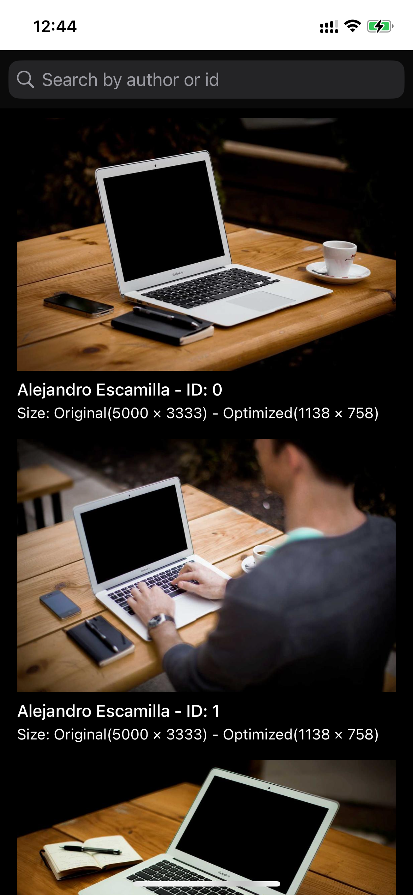

# PicsumApp - iOS Picsum Photo Search

## Side project using UITableView without 3rd party libraries
Device test: iPhone 12 Pro - iOS 18.3.2

## Screenshot

## Techniques
- Clean Architecture + MVVM
- Multi layer cache with promotion: Ram Cache > Disk Cache
- Dependency injection with simple container
- Observer Pattern

## Framework
- UIKit
- URLSession
- XCTest
- NSCache
- GCD
- CoreData

## Feature
- List Photo with load more, pull refresh
- Search photo, support swipe typing

## Points
- Using CoreData cache all photo entity from Picsum when using the app for the first time
- Filter Photo by ID and Author from CoreData instead of API(Picsum not support endpoint for filter by author)
- When loading images, the loading order will be: Ram Cache > Disk Cache > Fetch Network
- Load images according to user viewport allowing smooth scroll in table view